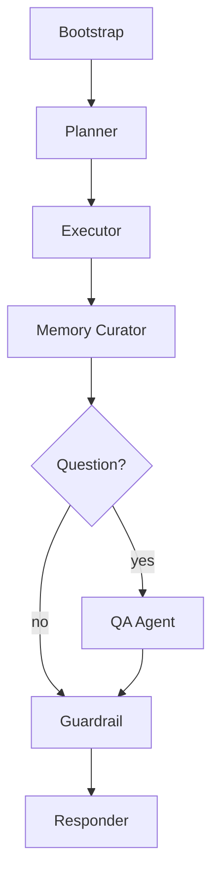

# DAWN Agent Architecture (Dev Showcase)

This project is intentionally dev-only and optimized for interview walkthroughs. The agent
system is deterministic by default, with explicit reasoning fields (`rationale`, `intent`)
so you can explain *why* a step was chosen and *what* it is meant to do.

## Goals
- Turn feed profiles into a **traceable analysis plan**.
- Execute deterministic metrics with **auditable reasoning**.
- Curate a **memory layer** for future questions with citations.
- Answer user questions with a **QA agent** backed by retrieval.

## Agent Roles and Responsibilities

1. **Bootstrap Agent**
   - Loads the latest feed snapshot and backend sources.
   - Sets the session goal (from a user question or a default).

2. **Planner Agent**
   - Converts profile metadata into a plan (counts, aggregates, schema inventory).
   - Adds `rationale` and `intent` to each step for interview-grade explainability.

3. **Executor Agent**
   - Runs each plan task using deterministic summaries and metrics.
   - Emits structured results with the originating rationale.

4. **Memory Curator**
   - Condenses results into short context snippets.
   - Writes those snippets to Redis for downstream RAG and question answering.

5. **QA Agent**
   - Uses the retrieval layer to answer natural language questions.
   - Returns citations tied to stored context chunks.

6. **Guardrail Agent**
   - Flags missing or incomplete outputs.
   - Ensures the final report highlights risks or gaps.

7. **Responder Agent**
   - Produces a human-readable report with the goal, results, and warnings.

## Reasoning and Intent (What Makes It Agentic)
- Each plan step includes **rationale** and **intent** fields generated in the planner.
- The executor attaches these fields to each result so reasoning is preserved end-to-end.
- The run log (`run_log`) provides a chronological trace of agent actions.

## Agent Graph (Current Implementation)

## Data Flow Summary
- **Input:** feed identifier + optional question
- **Profile source:** Postgres (feed versions) + Redis (context)
- **Plan output:** tasks with `rationale` and `intent`
- **Results:** deterministic metrics + backend schema inventory previews
- **Memory:** Redis RAG chunks for future Q&A
- **Final report:** human-readable narrative for walkthroughs

## Where This Lives in Code
- Agent orchestration: `app/core/agent_graph.py`
- Feed profiling: `app/core/feed_ingest.py`
- RAG store + retrieval: `app/core/rag.py`
- API entry point: `app/api/agents.py`
