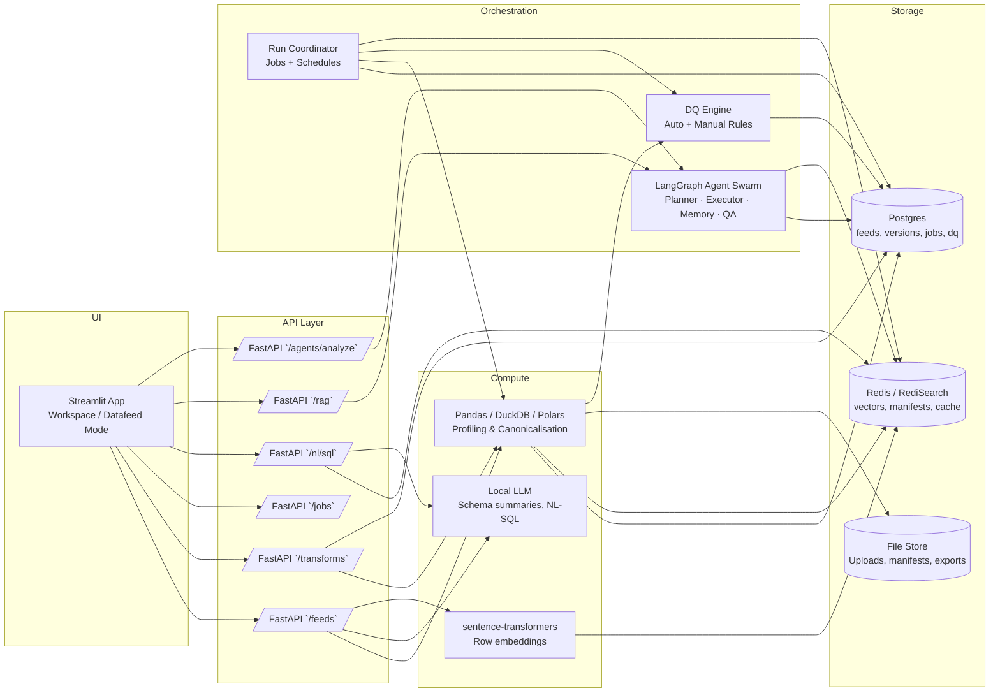
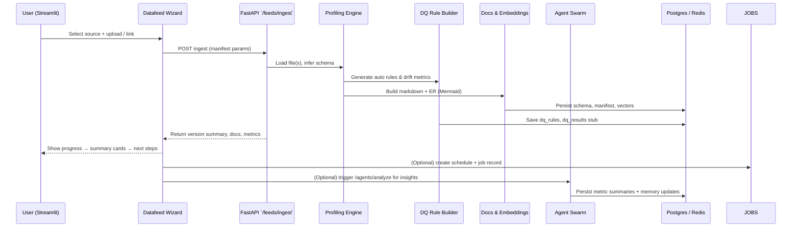
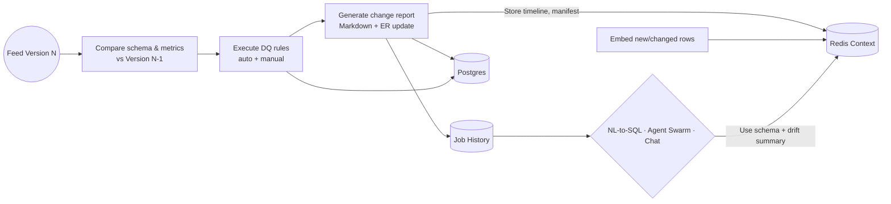

# DAWN Datafeed Platform — Architecture & Roadmap

## High-Level Architecture

## Feed Onboarding Flow

## Run Lifecycle & Drift Intelligence

## Roadmap by Sprint

### Sprint 1 — Schema & Validation Foundations
- [x] Simplified upload & preview workspace with manifest summary and indexing hand-off.
- [x] Profiling engine upgrades for schema inference & drift metrics.
- [x] Auto DQ rule framework (PK uniqueness, null thresholds, datetime checks).
- [x] Change summaries between versions (rows, columns, null deltas).
- [x] Persist manifest, ER diagram, and profiling stats in Redis/Postgres.

### Sprint 2 — Connectors, Scheduling & NL Querying
- [x] Row embeddings + Redis vector index per feed.
- [x] NL-to-SQL enhancements with context-aware question suggestions.
- [x] Iterate on the tabbed Streamlit experience (Upload & Preview, Context & Memory, **Agent Swarm**, Ask Dawn).
- [x] Expose multi-agent `/agents/analyze` endpoint for automated plan execution.
- [ ] Source connectors (S3, shared folder watch, Snowflake).
- [ ] Credential management + connection tests.
- [ ] Job scheduling UI (cron presets, manual runs, notifications).
- [ ] Unified data access layer (feeds + ad-hoc uploads) powering both workspaces.
- [ ] Feed export planner with manifest-driven targets (S3 + local outbox initial).
- [ ] Export configuration UI (target selection, format, schedule, notifications).
- [ ] Integrate exports into job runs with logging/alerting.

### Sprint 3 — Automation & Intelligence
- Drift timeline view & daily report cards.
- LLM “Explain this feed” + anomaly summaries.
- Watch-folder automation + manifest export/import.
- Notifications (email/Slack) for success/fail + drift anomalies.
- Optional synthetic data generator & feed templates.

### Stretch Goals
- Self-healing schema adjustments, smart merge across feeds.
- DAWN Agent for automated DQ fixes & transformation suggestions.
- Natural language SQL editor with live preview + execution sandbox.

## Sprint 1 Backlog Snapshot
- [x] Design streamlined upload→index flow with clear copy.
- [x] Upgrade profiling pipeline to capture schema drift & change metrics.
- [x] Auto-generate manifests and expose for download/edit.
- [x] Persist & display detailed summary cards (schema, PK/FK, drift, DQ).
- [x] Build DQ rule engine (auto rule persistence + evaluation hook).
- [ ] Update documentation & UX walkthrough for onboarding flow.

## Sprint 2 — In Progress

### Week 1: Scheduler & Documentation
- [ ] Polish API and user documentation
- [ ] Implement job scheduler with background worker (APScheduler)
- [ ] Add manual job trigger endpoints
- [ ] Test scheduled execution end-to-end
- [ ] Extend indexing UI with schedule configuration hooks
- [x] Document Agent Swarm workflow & monitoring in README/User Guide
